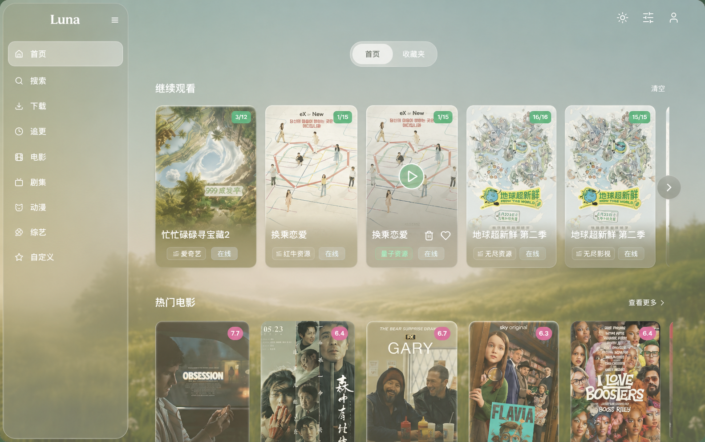
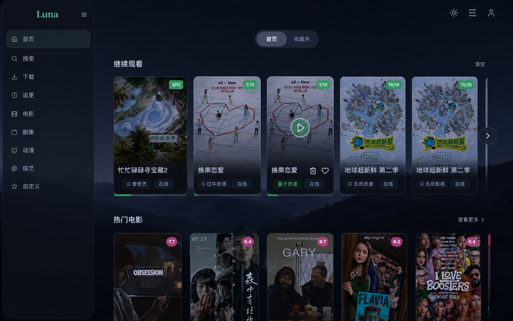

# Codex Pixel-Perfect UI Recreation Prompt

Use the two reference images below as the only visual source of truth.

Recreate this desktop UI as real components with pixel-accurate layout and matching atmosphere. Do not redesign, reinterpret, simplify, or "improve" the composition.

Reference rules:

- `light_reference.png` and `dark_reference.png` are both `1584x993`.
- Treat `light_reference.png` as the layout master.
- Treat `dark_reference.png` as the dark-theme material and color master.
- Light and dark themes must have identical geometry, spacing, radii, and structure.

Non-negotiable constraints:

- Build a complete runnable project with React `19` + TypeScript + Vite + Tailwind CSS `v4` + Framer Motion.
- Build the UI from real components, not a flattened screenshot, iframe, or full-page background cheat.
- Use local assets only.
- You may crop poster or image fragments from the provided references only when no standalone asset exists.
- Preserve the Chinese copy shown in the references.
- If a visible value can be measured from the references, measure it instead of guessing.
- If the exact font cannot be identified, use the closest visible match and note that briefly.

Fidelity target:

- `1584x993` is the only pixel-perfect acceptance size.
- At that size, match the reference within about `1-2px` for major structure: sidebar width, page padding, top-right icon placement, segmented control size/alignment, section heading offsets, card sizes, card gaps, corner radii, and the right-side scroll indicator position.
- Preserve the same card count, row density, hierarchy, and overall proportions.

Visual landmarks that must match:

- Full-bleed scenic background with heavy atmospheric blur and depth.
- Tall left glass sidebar with `Luna` wordmark, compact menu trigger, and stacked navigation.
- Centered top segmented control with a filled active pill.
- Three top-right utility icons with airy spacing.
- First media row with translucent glass cards and a clear active-state treatment.
- Second media row with poster-heavy cards and floating score badges.
- Slim vertical scroll/progress indicator on the right edge.

Theme and material rules:

- Theme switching may change only color, opacity, blur, border color, glow, and shadow.
- Dark theme must use deep navy and teal tones, not pure black.
- Light theme must keep the warm misty sage and ivory atmosphere from the reference.
- Recreate the layered liquid-glass look with separate fill, border, blur, and shadow treatment.
- Borders must stay subtle and luminous, never heavy or flat.
- Do not introduce unrelated brand colors or generic purple glassmorphism.

Typography and motion:

- Match perceived type scale, weight, spacing, and hierarchy from the screenshots.
- Preserve the visual character of the `Luna` wordmark.
- Use restrained motion only because the references are static:
  - theme transition: `200-250ms`
  - segmented control thumb: `180-220ms`
  - card hover/focus: subtle lift or glow only, `160-200ms`
- Avoid exaggerated scaling, parallax, staggered entrances, or decorative motion not implied by the references.

Responsive behavior:

- This task is desktop-first, not mobile-first.
- Below the primary canvas, preserve proportions as long as possible.
- Prefer proportional scaling and controlled spacing reduction over structural reflow.
- Do not invent drawer, bottom-nav, or mobile-specific patterns.

Implementation requirements:

- Use reusable design tokens for colors, blur, radii, spacing, and shadows.
- Keep layout constants explicit and traceable to the references.
- Use a componentized architecture.
- Do not omit any major visual landmark visible in the references.
- Do not replace the composition with generic streaming-app UI patterns.

Acceptance criteria:

- The app runs with normal install and dev commands.
- A screenshot at `1584x993` closely matches the light reference.
- The dark theme closely matches the dark reference with the exact same geometry.
- Theme switching does not move or resize layout.
- No placeholder lorem ipsum or unrelated substitute art appears.

If forced to choose between "cleaner modern UI" and "closer to the reference," choose the reference every time.
