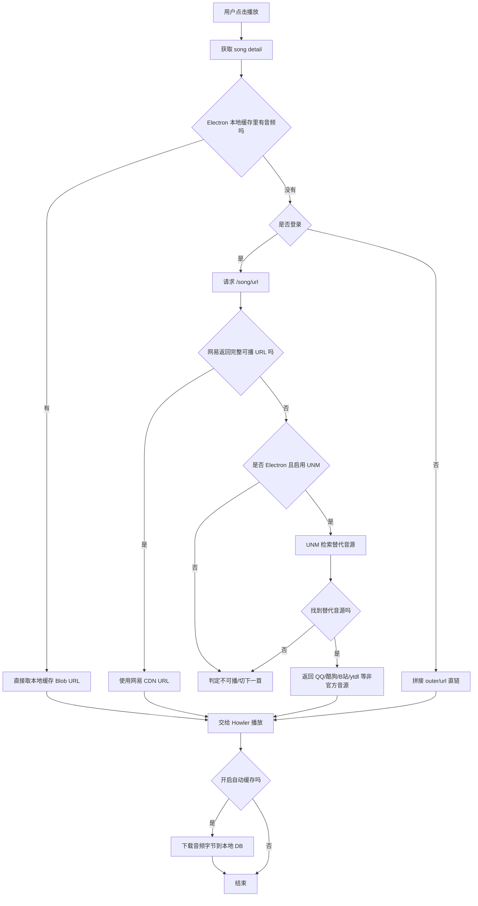
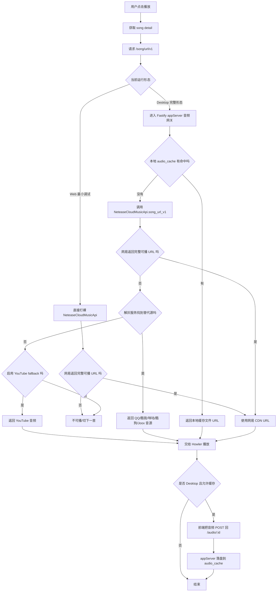

# YesPlayMusic 两代项目接口实现与可用性研究报告

生成日期：2026-07-01  
研究范围：

- 旧版仓库：`D:\AI-AGE\YesPlayMusic`，分支 `master`，当前提交 `df075cc`，`package.json` 版本 `0.4.10`
- 新版仓库：`D:\AI-AGE\YesPlayMusic-new-design`，工作树对应 `origin/new-design`，当前提交 `5c2c802`，`packages/web` 与 `packages/desktop` 版本 `2.0.0`
- 截图证据：`D:\AI-AGE\YesPlayMusic\_screens`
- 本报告重点：接口实现、代理层、依赖拓扑、实际可用性、对后续项目开发的借鉴价值

## 1. 结论先行

### 1.1 最重要的结论

1. 不是“旧 API 已死、新 API 还活”。
2. 两套项目本质上都建立在 NetEase API 家族之上，只是接入架构不同。
3. 旧版此前出现“白色空壳 + 顶栏”，主因不是 API 全面失效，而是 `VUE_APP_NETEASE_API_URL` 未正确指向 `/api`。
4. 新版确实更现代，但它不只是“换了几个 endpoint”，而是把系统拆成了三层：`web`、`desktop appServer`、`r3play server`。
5. 新版前端单独跑起来，不等于新版全接口可用。很多看似“新版接口”实际上依赖它自己的中间层，不是裸 `NeteaseCloudMusicApi` 直接提供的。

### 1.2 对以后开发最有价值的判断

1. 旧版适合研究“最直接的网易云 API 客户端接法”，实现简单，但对环境变量和返回结构比较脆弱。
2. 新版适合研究“桌面播放器的完整后端化接口层”，包括缓存、音频替换、解灰、Apple Music 补充信息，但部署复杂度明显更高。
3. 如果以后要做自己的项目，建议参考新版的分层思路，但不要照抄它“开发环境里直接 `@latest` 拉 API 包”的做法，复现性太差。

## 2. 两代项目到底是什么关系

### 2.1 旧版 `master`

- 技术栈：Vue 2 + Vue CLI + Electron
- 视觉风格：白底、圆角、Apple Music / 网易云混合风格
- 首页实现：`src/views/home.vue`
- 接口调用方式：前端直接请求 `VUE_APP_NETEASE_API_URL`，开发环境通常通过 `/api -> localhost:3000` 代理
- Electron 模式下还会额外启动本地 API 服务，并由本地 Express 再代理一次

### 2.2 新版 `origin/new-design`

- 技术栈：React + Vite + Electron + Fastify + 独立 server package
- 视觉风格：黑色、无边框、超大圆角、R3PLAY 风格
- `v2.0.0-alpha-2` 是它的较早标签，当前 `origin/new-design` 在其之后
- 这不是旧版的简单换皮，而是接口层和运行拓扑都重写了

### 2.3 UI 证据

已实际运行并截图，关键文件如下：

- 旧版修复后首页：`D:\AI-AGE\YesPlayMusic\_screens\master-home-fixed.png`
- 旧版最初错误态：`D:\AI-AGE\YesPlayMusic\_screens\master-home-debug.png`
- 新版首页：`D:\AI-AGE\YesPlayMusic\_screens\new-design-home.png`
- 新版 Discover：`D:\AI-AGE\YesPlayMusic\_screens\new-design-discover-shell.png`
- 新版 Browse：`D:\AI-AGE\YesPlayMusic\_screens\new-design-browse-shell.png`

补充判断：

1. 旧版首页不是“空白壳设计”，而是多段横向内容区：首页推荐歌单、For You、新专辑、排行榜、推荐艺人。
2. 旧版首页里的 “by Apple Music” 只是静态数据展示，不是 Apple Music 实时接口。
3. 新版 Discover/Browse 是大尺寸封面拼贴墙，视觉主角是图片，不是文案。

## 3. 旧版 `master` 的接口实现

### 3.1 请求入口与环境变量

关键文件：

- `D:\AI-AGE\YesPlayMusic\src\utils\request.js`
- `D:\AI-AGE\YesPlayMusic\.env.example`
- `D:\AI-AGE\YesPlayMusic\vue.config.js`

实现特点：

1. `request.js` 会根据是否 Electron 选择不同 `baseURL`。
2. Web 模式下使用 `VUE_APP_NETEASE_API_URL`。
3. `.env.example` 默认值就是 `/api`。
4. `vue.config.js` 把 `/api` 代理到 `http://localhost:3000`。

这意味着旧版 Web 开发模式的正确拓扑是：

`浏览器 -> 8081 -> /api -> 3000 -> NetEase API`

如果 `VUE_APP_NETEASE_API_URL` 没有设置成 `/api` 或正确地址，旧版就可能表现为页面骨架还在，但数据区不渲染。

### 3.2 Electron 模式下的旧版 API 拓扑

关键文件：

- `D:\AI-AGE\YesPlayMusic\src\electron\services.js`
- `D:\AI-AGE\YesPlayMusic\src\background.js`
- `D:\AI-AGE\YesPlayMusic\src\ncmModDef.js`

实现特点：

1. Electron 主进程会调用 `startNeteaseMusicApi()`。
2. 该函数直接在本地 `10754` 端口启动 `@neteaseapireborn/api/server`。
3. `background.js` 里的 Express 再把 `/api` 代理到 `http://127.0.0.1:10754`。
4. 旧版 Electron 不是“网页直连第三方 API”，而是“内置本地 API 服务 + 本地代理”。

旧版 Electron 拓扑是：

`渲染进程 -> /api -> Express(27232) -> 内置 NCM API(10754)`

### 3.3 旧版接口层特征

主要接口文件：

- `src/api/album.js`
- `src/api/artist.js`
- `src/api/auth.js`
- `src/api/mv.js`
- `src/api/others.js`
- `src/api/playlist.js`
- `src/api/track.js`
- `src/api/user.js`
- `src/api/lastfm.js`

主要特点：

1. 前端接口路径基本直接照着上游 API 写，没有再抽象一层别名。
2. 旧版一共 9 个接口文件，`url:` 定义约 57 处。
3. `request.js` 的请求拦截器还会注入 `MUSIC_U`、`realIP`、用户自定义代理参数。
4. `track.js` 对歌词和歌曲详情做了客户端缓存。
5. `lastfm.js` 是完全独立于网易云 API 的外部集成。

### 3.4 旧版的典型 endpoint

| 类别         | 旧版 endpoint                                            | 说明              |
| ------------ | -------------------------------------------------------- | ----------------- |
| 推荐歌单     | `/personalized`                                          | 首页依赖          |
| 每日推荐歌单 | `/recommend/resource`                                    | 需要登录          |
| 歌单详情     | `/playlist/detail`                                       | 常用核心接口      |
| 新专辑       | `/album/new`                                             | 首页依赖          |
| 歌手榜       | `/toplist/artist`                                        | 首页依赖          |
| 榜单总览     | `/toplist`                                               | 首页依赖          |
| 歌曲详情     | `/song/detail`                                           | 播放和列表依赖    |
| 播放地址     | `/song/url` + `br`                                       | 旧版音频 URL 模式 |
| 歌词         | `/lyric`                                                 | 支持缓存          |
| FM           | `/personal_fm` / `/fm_trash`                             | 保持上游命名      |
| 每日签到     | `/daily_signin`                                          | 保持上游命名      |
| 二维码登录   | `/login/qr/key` + `/login/qr/create` + `/login/qr/check` | 三步走            |
| 云盘         | `/cloud`、`/user/cloud*`                                 | 客户端启用        |
| 心动模式     | `/playmode/intelligence/list`                            | 客户端启用        |

### 3.5 旧版首页为什么容易被误判为“API 挂了”

关键文件：

- `D:\AI-AGE\YesPlayMusic\src\views\home.vue`
- `D:\AI-AGE\YesPlayMusic\src\utils\playList.js`

首页数据流有几个特点：

1. `home.vue` 对接口返回结构假设很强，直接访问 `data.albums`、`data.list.artists`、`data.list`、`response.result`。
2. `getRecommendPlayList()` 还会在登录态和未登录态之间切换不同逻辑。
3. 一旦 `baseURL` 错了、接口报错、返回值为空、或响应结构变化，首页就可能只剩框架壳。

因此，旧版“看起来像 API 挂了”的情况，常常其实是：

- `baseURL` 没配对
- 某个依赖接口异常
- 页面对异常返回缺少保护

而不是“整套老 API 已经不能用了”

## 4. 新版 `new-design` 的接口实现

### 4.1 新版不是一层，而是三层

关键目录：

- `D:\AI-AGE\YesPlayMusic-new-design\packages\web`
- `D:\AI-AGE\YesPlayMusic-new-design\packages\desktop`
- `D:\AI-AGE\YesPlayMusic-new-design\packages\server`

新版至少有三种接口角色：

1. `packages/web`：前端接口调用层
2. `packages/desktop/main/appServer`：桌面端本地 Fastify 中间层
3. `packages/server`：独立服务端，主要承接 Apple Music 相关 `/r3play/*` 路由

这是新版和旧版最大的本质差异。

### 4.2 新版 Web 请求入口

关键文件：

- `D:\AI-AGE\YesPlayMusic-new-design\packages\web\utils\request.ts`
- `D:\AI-AGE\YesPlayMusic-new-design\packages\web\vite.config.ts`
- `D:\AI-AGE\YesPlayMusic-new-design\.env.example`

实现特点：

1. 开发环境里 `baseURL` 固定是 `/netease`。
2. 生产环境里用 `VITE_APP_NETEASE_API_URL`。
3. Vite 代理会把 `/netease/*` 转到 `ELECTRON_DEV_NETEASE_API_PORT`。
4. 还会把 `/r3play/*` 也代理到同一个端口。

单看 `packages/web` 时，表面拓扑是：

`浏览器 -> 42710 -> /netease or /r3play -> 30001`

但这个 `30001` 究竟是“裸 NeteaseCloudMusicApi”还是“新版自己的 appServer”，取决于你怎么启动。

### 4.3 新版 desktop appServer

关键文件：

- `D:\AI-AGE\YesPlayMusic-new-design\packages\desktop\main\appServer\appServer.ts`
- `D:\AI-AGE\YesPlayMusic-new-design\packages\desktop\main\appServer\routes\netease\netease.ts`
- `D:\AI-AGE\YesPlayMusic-new-design\packages\desktop\main\appServer\routes\r3play\audio.ts`
- `D:\AI-AGE\YesPlayMusic-new-design\packages\shared\CacheAPIs.ts`

实现特点：

1. appServer 使用 Fastify。
2. 在开发态默认监听 `30001`。
3. 它会注册三组服务：
   - `netease`
   - `audio`
   - `appleMusic`
4. `netease.ts` 会遍历 `NeteaseCloudMusicApi` 导出的模块，自动注册 `/netease/...` 路由。
5. 注册时使用 `pathCase()`，所以很多上游的下划线路由会被转成斜杠风格。
6. `CacheAPIs.ts` 定义了它在服务端缓存的 API 列表。

这意味着新版桌面端不是“前端直接打 API”，而是：

`前端 -> Fastify appServer -> NeteaseCloudMusicApi / 自定义逻辑 / 本地缓存 / 额外服务`

### 4.4 新版的关键增强点

#### 4.4.1 音频接口被重写

关键文件：`packages/desktop/main/appServer/routes/r3play/audio.ts`

新版不是简单请求 `/song/url/v1` 就结束，它还会：

1. 先查本地音频缓存
2. 再请求 `NeteaseCloudMusicApi.song_url_v1`
3. 如果网易返回的 URL 不能直接用，会走 `@unblockneteasemusic/server`
4. 如果开启相关设置，还会尝试 YouTube 匹配
5. 还提供本地缓存音频的上传/读取路由

这是新版真正的核心价值之一，旧版没有这套后端增强层。

#### 4.4.2 Apple Music 信息不再是静态展示

关键文件：

- `packages/web/api/appleMusic.ts`
- `packages/desktop/main/appServer/routes/r3play/appleMusic.ts`
- `packages/server/src/routes/apple-music/album.ts`
- `packages/server/src/routes/apple-music/artist.ts`
- `packages/server/src/utils/appleMusicRequest.ts`

新版有真实的 Apple Music 补充信息链路：

1. 前端请求 `/r3play/apple-music/album` 和 `/r3play/apple-music/artist`
2. desktop appServer 可把它代理到 `35530`
3. `packages/server` 再去请求 Apple Music AMP API
4. 该服务依赖 `APPLE_MUSIC_TOKEN`

旧版首页虽然也出现 “by Apple Music”，但只是静态内容。新版才是真的 Apple Music 数据集成。

#### 4.4.3 路由命名不再完全等于上游 API 名

因为 `netease.ts` 用了 `pathCase()`，所以下列映射会出现：

| 上游常见写法   | 新版中间层写法  |
| -------------- | --------------- |
| `daily_signin` | `/daily/signin` |
| `fm_trash`     | `/fm/trash`     |
| `personal_fm`  | `/personal/fm`  |

这件事非常重要，因为：

1. 这让前端代码看起来更“REST 风格”
2. 但它也让新版前端不再能直接假设“裸上游 API 一定兼容”

### 4.5 新版 Web 客户端的 endpoint 变化

主要接口文件：

- `packages/web/api/album.ts`
- `packages/web/api/artist.ts`
- `packages/web/api/auth.ts`
- `packages/web/api/mv.ts`
- `packages/web/api/personalFM.ts`
- `packages/web/api/playlist.ts`
- `packages/web/api/r3play.ts`
- `packages/web/api/search.ts`
- `packages/web/api/track.ts`
- `packages/web/api/user.ts`
- `packages/web/api/appleMusic.ts`

主要变化：

1. 新版接口文件增加到 11 个，但客户端显式 `url:` 定义约 48 处。
2. 新版多了 `search/multimatch`、`search/suggest`。
3. 新版音频改成 `/song/url/v1` + `level=exhigh`。
4. 新版二维码登录只用 `key` 和 `check`，二维码图本身在前端用 `qrcode` 库生成，不再依赖 `/login/qr/create`。
5. 新版用户云盘相关调用在 `user.ts` 里基本被注释掉了，说明客户端能力比旧版更收缩。
6. 新版没有看到旧版那种显式的 `/playmode/intelligence/list` 客户端封装。

### 4.6 新版二维码登录的具体差异

关键文件：

- 旧版：`D:\AI-AGE\YesPlayMusic\src\api\auth.js`
- 新版：`D:\AI-AGE\YesPlayMusic-new-design\packages\web\api\auth.ts`
- 新版二维码组件：`D:\AI-AGE\YesPlayMusic-new-design\packages\web\components\Login\LoginWithQRCode.tsx`

差异如下：

| 项目       | 旧版               | 新版                                                                  |
| ---------- | ------------------ | --------------------------------------------------------------------- |
| 获取 key   | `/login/qr/key`    | `/login/qr/key`                                                       |
| 生成二维码 | `/login/qr/create` | 前端直接把 `https://music.163.com/login?codekey=...` 生成成本地二维码 |
| 轮询状态   | `/login/qr/check`  | `/login/qr/check`                                                     |

这说明新版减少了一次后端往返，也降低了对 `/login/qr/create` 的依赖。

## 5. 旧版与新版接口对比

### 5.1 核心对比表

| 维度               | 旧版 `master`                    | 新版 `new-design`                                                    |
| ------------------ | -------------------------------- | -------------------------------------------------------------------- |
| 前端框架           | Vue 2                            | React                                                                |
| Web 开发代理前缀   | `/api`                           | `/netease` + `/r3play`                                               |
| 直连 API 风格      | 直接照上游 endpoint 写           | 一部分照上游，一部分依赖自定义中间层别名                             |
| 音频 URL 接口      | `/song/url` + `br`               | `/song/url/v1` + `level`                                             |
| FM 接口            | `/personal_fm`、`/fm_trash`      | 浏览器用 `/personal_fm`，桌面端用 `/personal/fm`；删除用 `/fm/trash` |
| 每日签到           | `/daily_signin`                  | `/daily/signin`                                                      |
| 二维码登录         | `key + create + check`           | `key + check`，二维码前端生成                                        |
| 云盘能力           | 客户端启用                       | 客户端大多注释掉                                                     |
| 心动模式           | 有 `/playmode/intelligence/list` | 未发现对应客户端封装                                                 |
| Apple Music        | 静态展示                         | 真实远程接口集成                                                     |
| 音频缓存/解灰/替换 | 无                               | 有                                                                   |
| 服务端缓存         | 主要在客户端缓存歌词/详情        | 在 appServer 中央缓存多类 API                                        |

### 5.2 并不是“新版把所有旧接口都换掉了”

本次实测说明：

1. `/personalized`
2. `/album/new`
3. `/toplist/artist`
4. `/toplist`
5. `/personal_fm`
6. `/song/detail`
7. `/login/qr/key`

这些核心接口在旧版 API 服务和新版裸 API 服务里都还能正常返回相同结构级别的数据。

真正有分叉的是：

1. 音频地址接口从 `/song/url` 迁移到 `/song/url/v1`
2. 一批下划线命名路由在新版桌面层被包装成斜杠风格
3. 新版增加了 `/r3play/*` 这一整套自定义能力

### 5.3 网易云音频资源到底是不是“官方源”

这一点需要拆成三层理解，否则很容易误判。

#### 5.3.1 默认优先请求的是网易自己的音频资源

两套项目默认都会先尝试从网易云侧拿可播放地址：

1. 旧版通过 `/song/url` 用歌曲 `id` 换真实播放地址。
2. 新版通过 `/song/url/v1` 用歌曲 `id` 换真实播放地址。
3. 新版代码里还会把 `126.net` 识别为 `netease` 源，说明其默认期望拿到的是网易自己的 CDN 音频地址。

因此，如果一首歌在网易云侧可正常播放，两套项目默认优先消费的是网易自己的音频资源，而不是一上来就去第三方找替代源。

#### 5.3.2 但它们不是通过网易官方开放 SDK 在取音频

虽然默认优先拿的是网易云资源，但两套项目都不是使用“网易官方面向开发者的公开 SDK / 官方开放平台接口”。

实际使用的是第三方封装层：

1. 旧版依赖 `@neteaseapireborn/api`
2. 新版 desktop 依赖 `NeteaseCloudMusicApi`
3. 新版 web 开发调试时甚至直接用 `npx NeteaseCloudMusicApi@latest`

所以准确说法应该是：

- 默认优先请求网易官方音频资源
- 但不是通过网易官方开放 SDK
- 而是通过第三方兼容 API 层去换取网易云可播放地址

#### 5.3.3 一旦网易官方源不可播，就会掉到非官方替代源

这也是两套项目和普通“只做网易云壳子”的播放器最不同的地方。

旧版：

1. 登录态下先走 `/song/url`
2. 未登录时会直接拼 `https://music.163.com/song/media/outer/url?id=...`
3. 如果 Electron 模式开启 UNM，且网易云返回的地址不可用，就会通过 `@unblockneteasemusic/rust-napi` 去外部音源检索和取回音频
4. 默认 fallback 源列表包含 `ytdl`、`bilibili`、`pyncm`、`kugou`，也支持用户配置其他来源

新版：

1. 先查本地音频缓存
2. 再调用 `NeteaseCloudMusicApi.song_url_v1`
3. 如果网易返回试听片段或不可播，则走 `@unblockneteasemusic/server`
4. 当前代码里硬编码尝试 `qq`、`kuwo`、`migu`、`kugou`、`joox`
5. 如果用户开启设置，还可以继续退到 YouTube

因此，“最终播放到耳朵里的音频”并不总是网易官方源。只有在网易官方返回了完整可播 URL 的情况下，它才是官方源；否则两套项目都会回退到非官方替代源。

#### 5.3.4 对后续项目参考时应该如何表述

为了避免以后文档和设计决策里出现歧义，建议固定使用下面这组表述：

1. “默认优先走网易云官方音频资源”
2. “接口接入层不是网易官方 SDK，而是第三方兼容 API”
3. “当官方音频不可播时，允许回退到非官方替代源”
4. “新版把这套回退逻辑后端化了，旧版则更多放在 Electron 客户端内完成”

#### 5.3.5 音频获取流程图

旧版 `master`：



新版 `new-design`：



如何读这两张图：

1. 两代项目的共同点是，默认都先尝试从网易云拿可播放 URL。
2. 旧版的回退逻辑主要在 Electron 客户端里完成。
3. 新版把回退、缓存、音源替换都收口到了 appServer 音频网关。
4. 因此，新版“最终拿到的音频 URL”更像是一个服务端决策结果，而不是单纯的网易 URL 透传。

## 6. 本地实际可用性验证

验证日期：2026-07-01  
验证机器：当前 Windows 开发环境  
监听中的关键端口：

- `3000`：旧版 API 服务
- `8081`：旧版 Vue Web
- `30001`：新版裸 `NeteaseCloudMusicApi`
- `42710`：新版 Vite Web

### 6.1 旧版 API 实测

以下接口均返回成功：

| 地址                                                   | 结果  |
| ------------------------------------------------------ | ----- |
| `http://127.0.0.1:3000/personalized?limit=1`           | `200` |
| `http://127.0.0.1:3000/album/new?area=ALL&limit=1`     | `200` |
| `http://127.0.0.1:3000/toplist/artist`                 | `200` |
| `http://127.0.0.1:3000/toplist`                        | `200` |
| `http://127.0.0.1:3000/personal_fm`                    | `200` |
| `http://127.0.0.1:3000/song/url?id=33894312&br=320000` | `200` |
| `http://127.0.0.1:3000/song/detail?ids=33894312`       | `200` |
| `http://127.0.0.1:3000/login/qr/key?...`               | `200` |

观察结果：

1. 老接口的核心公共数据接口并没有整体失效。
2. 旧版首页渲染恢复后，可以正常拿到推荐歌单、新专辑、榜单等数据。

### 6.2 新版裸 API 实测

以下接口均返回成功：

| 地址                                                          | 结果  |
| ------------------------------------------------------------- | ----- |
| `http://127.0.0.1:30001/personalized?limit=1`                 | `200` |
| `http://127.0.0.1:30001/album/new?area=ALL&limit=1`           | `200` |
| `http://127.0.0.1:30001/toplist/artist`                       | `200` |
| `http://127.0.0.1:30001/toplist`                              | `200` |
| `http://127.0.0.1:30001/personal_fm`                          | `200` |
| `http://127.0.0.1:30001/song/url/v1?id=33894312&level=exhigh` | `200` |
| `http://127.0.0.1:30001/song/detail?ids=33894312`             | `200` |
| `http://127.0.0.1:30001/login/qr/key?...`                     | `200` |

观察结果：

1. 新版所依赖的“公共网易云数据接口”本身也可用。
2. 问题不在于“新版能连、旧版不能连”，而在于新版客户端还有一层自己的中间层约定。

### 6.3 跨版本兼容性实测

| 测试                             | 结果  | 说明                                |
| -------------------------------- | ----- | ----------------------------------- |
| 旧版 API 调 `/song/url/v1`       | `200` | 旧版依赖的 API 包也已支持新音频接口 |
| 新版裸 API 调 `/song/url`        | `200` | 新版裸 API 仍兼容旧音频接口         |
| 旧版 API 调 `/login/qr/create`   | `200` | 旧版二维码三步流可用                |
| 新版裸 API 调 `/login/qr/create` | `200` | 新版虽然不用它，但上游仍支持        |

这进一步证明：

1. 新旧之间并不是彻底断代
2. 至少在音频和登录二维码这两块，上游兼容层还在

### 6.4 新版“看起来更先进”但更依赖中间层的实测证据

在当前“只跑 `packages/web` + 裸 `NeteaseCloudMusicApi`”的开发模式下：

| 地址                                                                  | 结果  |
| --------------------------------------------------------------------- | ----- |
| `http://127.0.0.1:42710/netease/personalized?limit=1`                 | `200` |
| `http://127.0.0.1:42710/netease/song/url/v1?id=33894312&level=exhigh` | `200` |
| `http://127.0.0.1:42710/netease/daily/signin?type=0`                  | `404` |
| `http://127.0.0.1:42710/netease/fm/trash?id=33894312`                 | `404` |
| `http://127.0.0.1:42710/netease/personal/fm`                          | `404` |
| `http://127.0.0.1:42710/r3play/apple-music/album?id=1612283108`       | `404` |

这组结果非常关键，说明：

1. 新版 Web 单独开发时，只能直接用那部分裸 API 本来就支持的接口。
2. 新版代码里出现的 `/daily/signin`、`/fm/trash`、`/personal/fm`，并不是裸上游 API 的原生命名。
3. 新版代码里出现的 `/r3play/apple-music/*`，也不是裸上游 API 能提供的。
4. 如果只把新版前端拿出来运行，却不补齐 appServer / server 层，很多功能会是假可用。

### 6.5 关于之前“旧版 API 失效”的纠正

需要明确纠正：

1. 之前旧版首页只剩白壳，不足以证明旧 API 整体失效。
2. 本地复跑后，旧版在 `VUE_APP_NETEASE_API_URL=/api` 配置正确时可以正常渲染首页。
3. 因此旧版问题更像“接入配置和页面脆弱性问题”，不是“接口体系已经废掉”。

### 6.6 本次验证的边界

1. 公共接口、代理链路、音频接口命名差异、Web 独立开发时的 404 行为，都是本地实跑验证过的。
2. 登录后功能，例如签到、收藏、云盘、FM 删除等，没有用真实账号做全链路业务验证，只验证了接口可达性或命名兼容性。
3. `packages/server` 的 Apple Music 成功返回没有在本机完成端到端验证，因为仓库里没有直接提供 `APPLE_MUSIC_TOKEN`；这一部分的判断主要来自代码链路和当前 standalone Web 调试下的 `404` 结果。
4. 新版 desktop `appServer` 的别名路由行为，虽然本次没有单独拉起一套独立端口做全量黑盒测试，但 `netease.ts` 的自动注册逻辑是明确的，因此“需要中间层别名”这个结论是可靠的。

## 7. 版本与复现性问题

### 7.1 旧版

- `D:\AI-AGE\YesPlayMusic\package.json` 依赖 `@neteaseapireborn/api`：`^4.29.7`
- 本地实际安装版本：`4.29.7`

特点：

1. 旧版 API 依赖是仓库内依赖，相对可复现。
2. 但 `^` 仍然意味着重新安装时可能升级到更高小版本。

### 7.2 新版

- `packages/desktop/package.json` 依赖 `NeteaseCloudMusicApi`：`^4.8.9`
- 本地 desktop 安装版本：`4.8.9`
- `packages/web/package.json` 开发脚本：`PORT=30001 npx NeteaseCloudMusicApi@latest`
- 本次实际跑起来的裸 API 版本：`4.32.0`

这有一个很明显的问题：

1. 新版 desktop 内嵌 API 版本和 web 开发时临时拉的 API 版本不是同一个。
2. `@latest` 让“今天开发可用”和“明天开发可用”之间没有稳定保证。
3. 同一个仓库内，web dev、desktop dev、线上 rewrites 实际上可能打到三种不同的服务实现。

这也是新版最大的工程风险之一。

## 8. 对以后开发项目的借鉴建议

### 8.1 推荐借鉴什么

建议借鉴新版这些思路：

1. 前端不要直接承担所有第三方 API 兼容性问题，应该有自己的中间层。
2. 音频播放地址相关逻辑应独立成专门服务，便于缓存、降级、回退和替换。
3. 把 Apple Music、YouTube、解灰这类“增强能力”隔离在后端服务，而不是塞进页面组件里。
4. 给高价值接口建立统一缓存键，例如新版 `CacheAPIs.ts` 的思路。

### 8.2 明确不要照抄什么

不建议直接照抄新版这些做法：

1. `packages/web` 用 `npx NeteaseCloudMusicApi@latest` 作为默认开发 API。
2. 前端代码使用一套别名路径，但没有在文档里明确说明哪些是裸 API、哪些是自定义别名。
3. `/r3play/*` 依赖外部地址，但本地开发文档没有把依赖链讲透。

### 8.3 如果我们以后做自己的播放器，建议的接口策略

建议按下面的规则设计：

1. 自己定义一层稳定网关，例如 `/api/music/*`。
2. 网关内部再决定转发到网易云接口、Apple Music、缓存层还是自研能力。
3. 前端只认我们自己的 contract，不直接认第三方接口细节。
4. 音频 URL、登录态、FM、签到、收藏等都由网关统一做兼容映射。
5. 严格固定依赖版本，禁止开发脚本默认使用 `@latest`。

## 9. 可直接复用的运行命令记录

### 9.1 旧版

```powershell
cd D:\AI-AGE\YesPlayMusic
yarn install --ignore-engines --ignore-scripts
node .\node_modules\electron\install.js
yarn --ignore-engines netease_api:run
$env:VUE_APP_NETEASE_API_URL='/api'
$env:DEV_SERVER_PORT='8081'
yarn --ignore-engines serve
```

### 9.2 新版当前这次调试使用的最小组合

```powershell
cd D:\AI-AGE\YesPlayMusic-new-design\packages\web
npm install

$env:PORT='30001'
npx NeteaseCloudMusicApi@latest

npm run dev -- --port 42710
```

注意：

1. 这只是“能看页面、能打通一部分接口”的最小组合。
2. 它不是新版完整能力的全量运行方式。
3. 完整新版还依赖 desktop appServer 和 `packages/server`。
4. 从仓库脚本设计看，根目录 `npm run dev` 更接近作者预期的完整开发入口，因为它会通过 Turborepo 并行调度有 `dev` 脚本的子包。
5. `packages/server` 默认跑在 `35530`，并且需要 `APPLE_MUSIC_TOKEN` 才能真正承载 Apple Music 数据链路。

## 10. 最终判断

如果目的是“研究 YesPlayMusic 的接口模型，作为我们后续项目参考”，最值得保留的认知是：

1. 旧版代表“前端直连第三方 API + 少量本地代理”的经典方案。
2. 新版代表“前端只是一层壳，真正能力收口到中间层和服务端”的升级方案。
3. 旧版并没有因为 API 老而完全失效。
4. 新版也不是天然更稳，它只是把复杂度从前端搬到了中间层。
5. 未来如果做自己的产品，应当选“新版的分层思想 + 比新版更严格的版本固定与本地文档”。

## 附录：本次研究中最关键的文件

旧版：

- `D:\AI-AGE\YesPlayMusic\src\utils\request.js`
- `D:\AI-AGE\YesPlayMusic\vue.config.js`
- `D:\AI-AGE\YesPlayMusic\src\electron\services.js`
- `D:\AI-AGE\YesPlayMusic\src\background.js`
- `D:\AI-AGE\YesPlayMusic\src\api\auth.js`
- `D:\AI-AGE\YesPlayMusic\src\api\track.js`
- `D:\AI-AGE\YesPlayMusic\src\api\others.js`
- `D:\AI-AGE\YesPlayMusic\src\api\playlist.js`
- `D:\AI-AGE\YesPlayMusic\src\api\user.js`
- `D:\AI-AGE\YesPlayMusic\src\views\home.vue`

新版：

- `D:\AI-AGE\YesPlayMusic-new-design\packages\web\utils\request.ts`
- `D:\AI-AGE\YesPlayMusic-new-design\packages\web\vite.config.ts`
- `D:\AI-AGE\YesPlayMusic-new-design\packages\web\api\auth.ts`
- `D:\AI-AGE\YesPlayMusic-new-design\packages\web\api\track.ts`
- `D:\AI-AGE\YesPlayMusic-new-design\packages\web\api\personalFM.ts`
- `D:\AI-AGE\YesPlayMusic-new-design\packages\web\api\appleMusic.ts`
- `D:\AI-AGE\YesPlayMusic-new-design\packages\web\components\Login\LoginWithQRCode.tsx`
- `D:\AI-AGE\YesPlayMusic-new-design\packages\desktop\main\appServer\appServer.ts`
- `D:\AI-AGE\YesPlayMusic-new-design\packages\desktop\main\appServer\routes\netease\netease.ts`
- `D:\AI-AGE\YesPlayMusic-new-design\packages\desktop\main\appServer\routes\r3play\audio.ts`
- `D:\AI-AGE\YesPlayMusic-new-design\packages\desktop\main\appServer\routes\r3play\appleMusic.ts`
- `D:\AI-AGE\YesPlayMusic-new-design\packages\shared\CacheAPIs.ts`
- `D:\AI-AGE\YesPlayMusic-new-design\packages\server\src\app.ts`
- `D:\AI-AGE\YesPlayMusic-new-design\packages\server\src\routes\apple-music\album.ts`
- `D:\AI-AGE\YesPlayMusic-new-design\packages\server\src\routes\apple-music\artist.ts`
